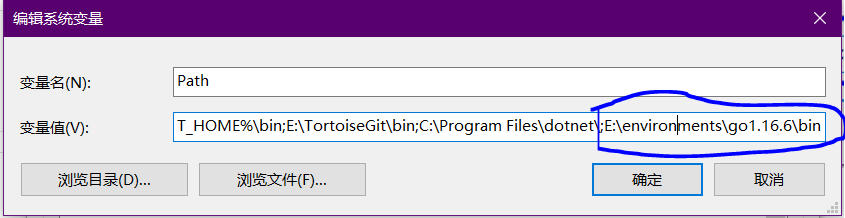
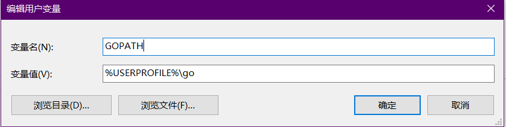
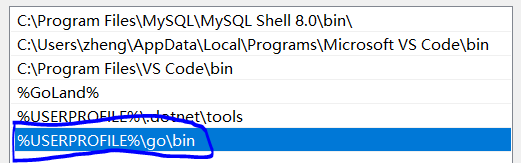
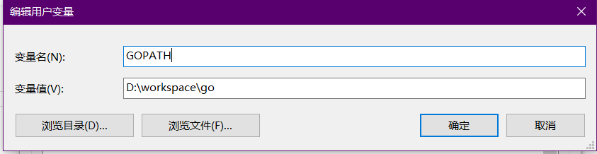
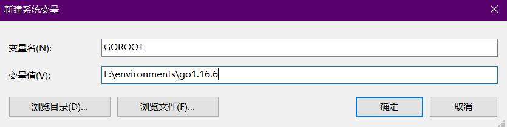
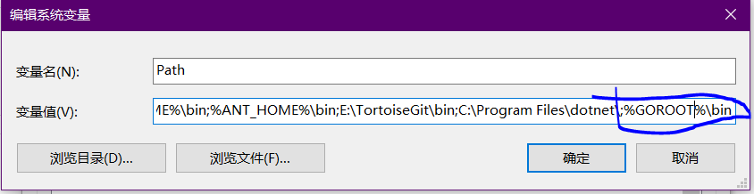
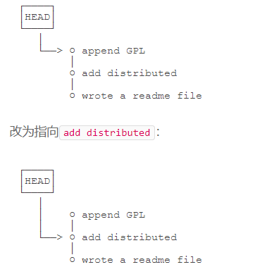
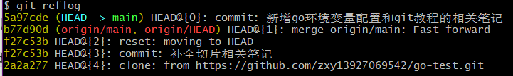
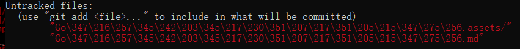
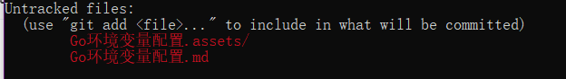

## Go环境变量配置

- 删掉环境变量中有关`Go`的配置，比如`GOROOT`,`GOPATH`,注意别把`GOLAND`的配置删了

- 安装Go

  - 安装go之后会自动帮你配置好环境变量，其中`GOROOT`配置在系统变量的`Path`中，如图所示:

  

  - `GOPATH`配置在用户变量的`GOPATH`和`Path`中,如图所示:

    



- 修改环境变量,虽然默认的也能用，但是不符合我们的使用习惯，所以我们可以修改环境变量来满足个人习惯

  - 修改`GOPATH`，需要修改的有两个点，第一个点是用户环境变量中的`GOPATH`，第二个点是用户环境变量中的`Path`,按下图修改:

  

  

  - 修改`GOROOT`，同样需要修改两个点，第一点是在系统变量中新增`GOROOT`，第二是修改系统变量中的`Path`，按下图修改：

    

    

- 打开`cmd`,输入`go env`，查看环境是否配置正确


## Git


### 安装

### 设置用户名和邮箱

```go
git config --global user.name	"zxy"								//设置用户名
git config --global user.email	"zhengxiaoying666@gmail.com"		//设置邮箱
```


### 创建仓库

在项目路径下执行命令,命令执行后会在项目路径下生成`.git`目录,该目录为隐藏目录

```
git init
```


### 将文件提交到仓库暂存区

```
git add [file1] [file2] ...		//添加一个或多个文件到暂存区
git add [dir]					//添加指定目录到暂存区,包括子目录
git add .						//添加当前目录下所有文件到暂存区
```


### 将暂存区内的修改提交到本地仓库

```
git commit -m "第一次提交"		
```

> `-m`后面输入的是本次提交的说明


### 查看仓库状态

```
git status
```


### 查看提交历史

```
git log 		//--pretty=oneline 只显示版本号和提交消息
```


### 版本表示

- `HEAD`表示当前版本,`HEAD^`表示上个版本,`HEAD^^`表示上上个版本,`HEAD~50`表示上50个版本

- 版本号，版本号可以独特表示某一版本

### 版本回退

基于上述的版本表示，可以使用`git reset`来进行版本回退，从而回退到某个版本

```
git reset --hard HEAD^		//回退到上个版本
git reset --hard 5a97cde	//回退到版本号为5a97cde的版本
```

版本回退图解：



Git在内部有个指向当前版本的`HEAD`指针，当你回退版本的时候，仅仅只是修改`HEAD`的指向而已

从最新的版本`append GPL`回退到`add distributed`后又想回到`append GPL`怎么处理？

```
git reflog	//git reflog用来记录你的每一次命令
```



前面的几位数字就是版本号,我们可以使用该版本号来回退版本


### 撤销修改

```
git checkout -- file1	//让这个文件回到最近一次git commit或git add时的状态
git reset HEAD <file>	//可以把暂存区的修改撤销掉（unstage）
```

小结：

场景1：当你改乱了工作区某个文件的内容，想直接丢弃工作区的修改时，用命令`git checkout -- file`。

场景2：当你不但改乱了工作区某个文件的内容，还添加到了暂存区时，想丢弃修改，分两步，第一步用命令`git reset HEAD <file>`，就回到了场景1，第二步按场景1操作。

场景3：已经提交了不合适的修改到版本库时，想要撤销本次提交，则需要版本回退，不过前提是没有推送到远程库。


### Git无法正常显示中文



```
git config --global core.quotepath false
```

输入此命令后即可正常显示




